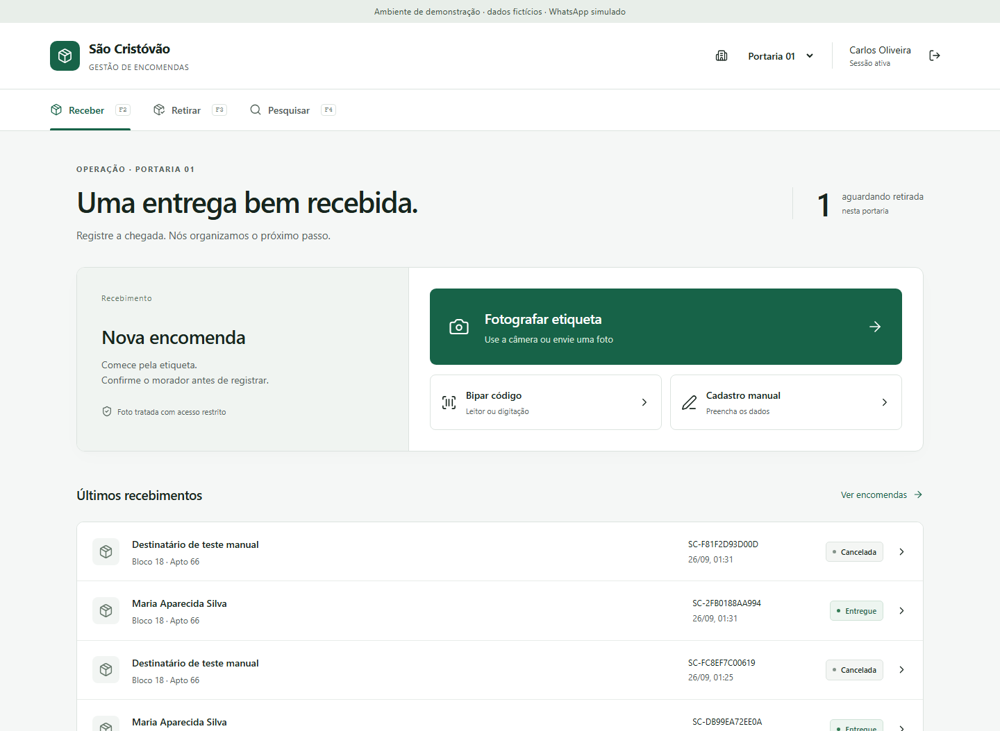

# São Cristóvão Entregas

Base de produção para recebimento e retirada de encomendas em condomínios. O vertical slice inclui autenticação, contexto de portaria, OCR com confirmação humana, identificação de morador, código público, PIN, notificação por WhatsApp, retirada e histórico auditável.



## Rodar a demonstração local

Pré-requisitos: Node.js 22+, pnpm 10+ e Python 3.12. Docker não é necessário para este modo.

```powershell
pnpm install
cd apps/ocr
python -m venv .venv
.\.venv\Scripts\python.exe -m pip install -r requirements-dev.txt
cd ../..
pnpm demo
```

Abra `http://127.0.0.1:3000`. Escolha a identidade de operador, supervisor ou administrador. A demonstração usa PostgreSQL embarcado persistente em `.data/postgres`, dados fictícios e `FakeWhatsAppProvider`. Segredos locais são gerados em `.data/demo-secrets.json` e não são versionados.

Para validar o OCR, envie [docs/demo-label.png](docs/demo-label.png). A primeira inicialização baixa e carrega os modelos PaddleOCR antes de publicar o health check; as próximas leituras reutilizam o processo aquecido. O cadastro manual continua disponível se o OCR falhar.

O modo demo aceita conexões apenas em loopback, não inicia com `NODE_ENV=production`, não envia WhatsApp real e não armazena fotos.

## Rodar com Supabase local

Supabase local requer Docker Desktop e Supabase CLI. Este computador não tinha Docker disponível durante a implementação; migrations e RLS foram executados nos testes com PostgreSQL embarcado compatível.

```powershell
Copy-Item .env.example .env
pnpm exec supabase start
pnpm exec supabase db reset
```

Preencha `.env` com a URL, chaves e URLs exibidas pelo `supabase status`. Gere valores independentes para `PIN_PEPPER`, `OUTBOX_ENCRYPTION_KEY` (64 caracteres hexadecimais) e `OCR_SERVICE_TOKEN`. Configure `DATABASE_URL` com um login dedicado, diferente de `postgres`, e `MIGRATION_DATABASE_URL` com o usuário de migração local. Depois:

```powershell
pnpm db:seed-auth
cd apps/ocr
.\.venv\Scripts\python.exe -m uvicorn main:app --host 127.0.0.1 --port 8000 --no-access-log --limit-concurrency 4
```

Em outros dois terminais:

```powershell
pnpm --filter @sc/api dev
pnpm --filter @sc/web dev
```

Contas locais criadas pelo seed: `operador@demo.local`, `supervisor@demo.local` e `admin@demo.local`, todas com a senha definida em `SEED_PASSWORD`. O script se recusa a operar contra hosts remotos ou com WhatsApp real.

## Rodar com o Supabase hospedado

O projeto `lskjkahbaqantxfhvvxc` já recebeu as migrations, políticas RLS, bucket privado de OCR, papéis de banco e o cadastro inicial do condomínio São Cristóvão. O arquivo `.env` local contém a conexão pelo Session Pooler com TLS verificado pelo certificado em `certs/supabase-prod-ca-2021.crt`.

Com as dependências e a `.venv` do OCR instaladas, inicie todo o sistema com:

```powershell
pnpm start:supabase
```

Abra `http://127.0.0.1:3000`. A conta inicial usa o e-mail `admin@sao-cristovao.local`; a senha está em `BOOTSTRAP_ADMIN_PASSWORD` no `.env` e não deve ser versionada. Para testar novamente a conectividade, autenticação, contexto do usuário, catálogo e OCR:

```powershell
pnpm smoke:supabase
```

No celular, o fluxo **Fotografar etiqueta** abre a câmera traseira dentro do site, captura a imagem e envia diretamente para extração. Em produção, a câmera interna do navegador exige HTTPS; em HTTP fora de `localhost`, o sistema oferece a câmera/galeria nativa como fallback.

## Publicar no Vercel

O arquivo `vercel.json` publica web, API e OCR no mesmo domínio por Vercel Services. Importe o repositório com a raiz no monorepo, selecione o preset **Services** e configure as variáveis descritas em [docs/VERCEL.md](docs/VERCEL.md). Não envie o `.env` ao GitHub nem copie segredos para `vercel.json`.

O ambiente hospedado começa sem blocos, unidades, moradores, telefones ou encomendas fictícias. Cadastre ou importe esses dados antes do piloto com moradores reais.

## Integrações externas pendentes

O `.env.example` documenta todas as variáveis. A conexão com o Supabase está configurada localmente. Para ativar notificações reais, ainda faltam as credenciais da Meta:

- `META_WHATSAPP_ACCESS_TOKEN`, phone number ID, verify token, app secret e versão Graph explicitamente suportada;
- template Meta aprovado com os sete parâmetros definidos em `MetaWhatsAppProvider`;
- URL pública HTTPS para `POST /webhooks/whatsapp` e assinatura `X-Hub-Signature-256`;
- política operacional para retenção de fotos. O padrão é zero dias.

O provider Meta impede o envio para os telefones fictícios do seed. Falha de notificação não desfaz o recebimento: a outbox persiste a tentativa e aplica retry com backoff.

## Validação

```powershell
pnpm lint
pnpm typecheck
pnpm test
pnpm build
cd apps/ocr
.\.venv\Scripts\python.exe -m pytest -q
.\.venv\Scripts\python.exe -m ruff check . --exclude .venv
.\.venv\Scripts\python.exe -m pip check
cd ../..
pnpm test:e2e
```

`pnpm test:e2e` espera `pnpm demo` em execução e o navegador Chromium instalado por `pnpm exec playwright install chromium`. Ele percorre a leitura real do arquivo de demonstração, confirmação, notificação fake, PIN, retirada e histórico; também cobre cadastro manual, cancelamento e layout mobile.

O smoke test de inferência real pode ser executado isoladamente:

```powershell
cd apps/ocr
.\.venv\Scripts\python.exe smoke.py
```

## Estrutura

```text
apps/
  web/          Next.js 16, React 19, TypeScript e Tailwind
  api/          NestJS 12, REST/OpenAPI, domínio e outbox
  ocr/          FastAPI, PaddleOCR e OpenCV
packages/
  ui/           componentes básicos compartilhados
  types/        contratos de resposta
  validation/   schemas Zod de entrada
  config/       TypeScript strict compartilhado
supabase/
  migrations/   schema, RLS, papéis e invariantes
  seed.sql      condomínios, portarias, unidades e moradores fictícios
docs/           arquitetura, segurança, banco, OCR e evidências visuais
```

Leia [docs/ARCHITECTURE.md](docs/ARCHITECTURE.md), [docs/SECURITY.md](docs/SECURITY.md), [docs/DATABASE.md](docs/DATABASE.md) e [docs/OCR.md](docs/OCR.md) antes de estender o produto.

## Limites atuais

O vertical slice está conectado ao Supabase hospedado, com migrations, políticas e autenticação validadas. Antes de produção, ainda é necessário homologar o template Meta e webhook com uma conta real, configurar observabilidade/alertas, revisar a política de backups e operar a retenção de imagens fora do processo da API. Administração de blocos e criação de usuários Auth permanece como operação da equipe da plataforma; o painel cobre moradores, unidades e associações de acesso existentes.
